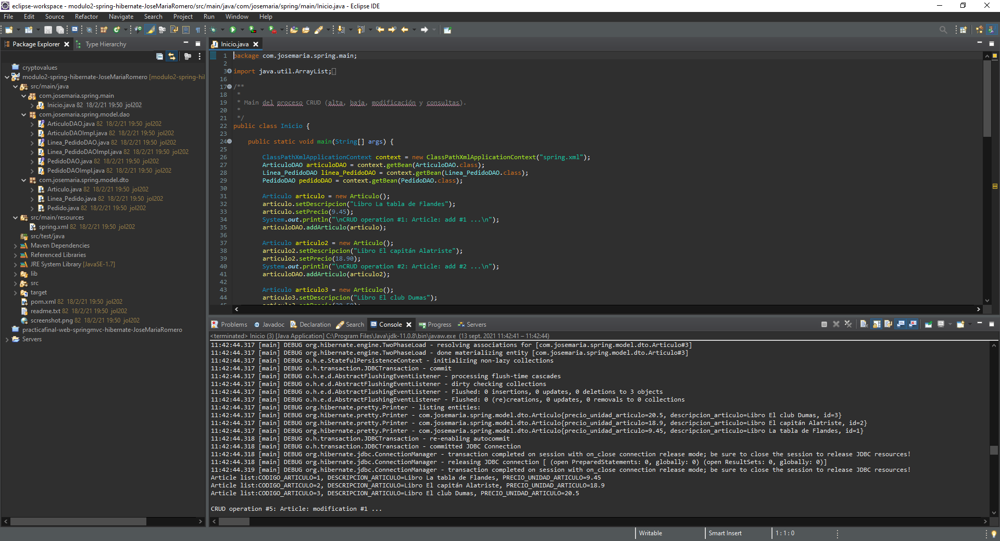
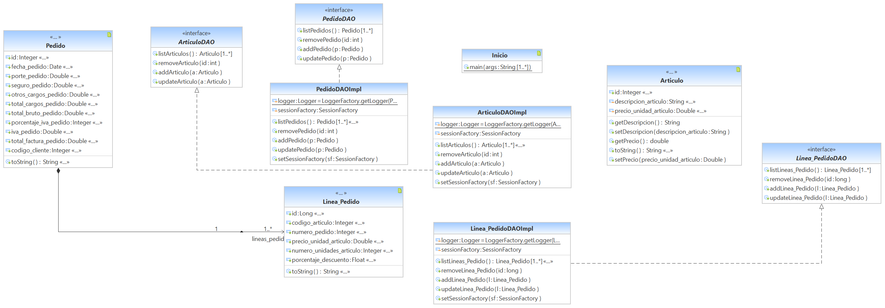

# spring-hibernate
Spring and Hibernate-based template for CRUD operations in databases using Java EE

## Application context

Java EE is a set of specifications for enterprise features such as distributed computing and web services. Java EE applications are run on reference runtimes, that can be microservices or application servers, which handle transactions, security, scalability, concurrency and management of the components it is deploying. It includes frameworks like Spring, Hibernate, JSF and Struts.

## Implementation

I created a database based on three tables called ARTICULOS, LINEA_PEDIDO and PEDIDOS using MySQL as DBMS (database management system).

The SQL sentences to create this database (see bd_creation sql file) are as follows:

```
DROP TABLE BD.ARTICULOS;
CREATE TABLE BD.ARTICULOS (
   CODIGO_ARTICULO INT UNSIGNED NOT NULL AUTO_INCREMENT,
   DESCRIPCION_ARTICULO VARCHAR(40),
   PRECIO_UNIDAD_ARTICULO DECIMAL(11,2),
   CANTIDAD INT,
   CONSTRAINT ARTICULOS_COD_ART_PK PRIMARY KEY (CODIGO_ARTICULO)
);

DROP TABLE BD.LINEA_PEDIDO;
CREATE TABLE BD.LINEA_PEDIDO (
   CODIGO_LINEA_PEDIDO INT UNSIGNED NOT NULL AUTO_INCREMENT,
   CODIGO_ARTICULO INT,
   NUMERO_PEDIDO INT,
   PRECIO_UNIDAD_ARTICULO DECIMAL(11,2),
   NUMERO_UNIDADES_ARTICULO INT,
   PORCENTAJE_DESCUENTO DECIMAL(4,2),
   CONSTRAINT LINEA_PEDIDO_COD_LIN_PED_PK PRIMARY KEY (CODIGO_LINEA_PEDIDO)
);

DROP TABLE BD.PEDIDOS;
CREATE TABLE BD.PEDIDOS (
   NUMERO_PEDIDO INT UNSIGNED NOT NULL AUTO_INCREMENT,
   FECHA_PEDIDO DATE,
   PORTE_PEDIDO DECIMAL(11,2),
   SEGURO_PEDIDO DECIMAL(11,2),
   OTROS_CARGOS_PEDIDO DECIMAL(11,2),
   TOTAL_CARGOS_PEDIDO DECIMAL(11,2),
   TOTAL_BRUTO_PEDIDO DECIMAL(11,2),
   PORCENTAJE_IVA_PEDIDO INT,
   IVA_PEDIDO DECIMAL(11,2),
   TOTAL_FACTURA_PEDIDO DECIMAL(11,2),
   CODIGO_CLIENTE INT,
   CONSTRAINT PEDIDOS_NUM_PED_PK PRIMARY KEY (NUMERO_PEDIDO)
);
```

For the rest of the application in Java EE I used Spring, Hibernate and Maven frameworks and Eclipse as IDE.



I provide the UML class diagram.



## Usage

[modulo2-spring-hibernate-JoseMariaRomero\src\main\java\com\josemaria\spring\main\Inicio.java](modulo2-spring-hibernate-JoseMariaRomero/src/main/java/com/josemaria/spring/main/Inicio.java)

I executed some CRUD operations:

CRUD operation #1: Article: add #1 ...  
CRUD operation #2: Article: add #2 ...  
CRUD operation #3: Article: add #3 ...  
CRUD operation #4: Article: consults ...  
CRUD operation #5: Article: modification #1 ...  
CRUD operation #6: Article: delete #3 ...  
CRUD operation #7: Pedido: add ...  
CRUD operation #8: Linea_Pedido: add #1 ...  
CRUD operation #9: Linea_Pedido: add #2 ...  
CRUD operation #10: Linea_Pedido: consults ...  
CRUD operation #11: Pedido: modification ...  
CRUD operation #12: Pedido: consults ...  

As a result, I can view the values of the different tables with these SQL sentences (see view_tables_bd sql file):

## Deliverable

that includes:

1. modulo2-spring-hibernate-JoseMariaRomero folder.
   - Java EE Eclipse project with the source code. You should use Maven build because the project is clean.
2. bd_creation sql file.
3. view_tables_bd sql file.  
